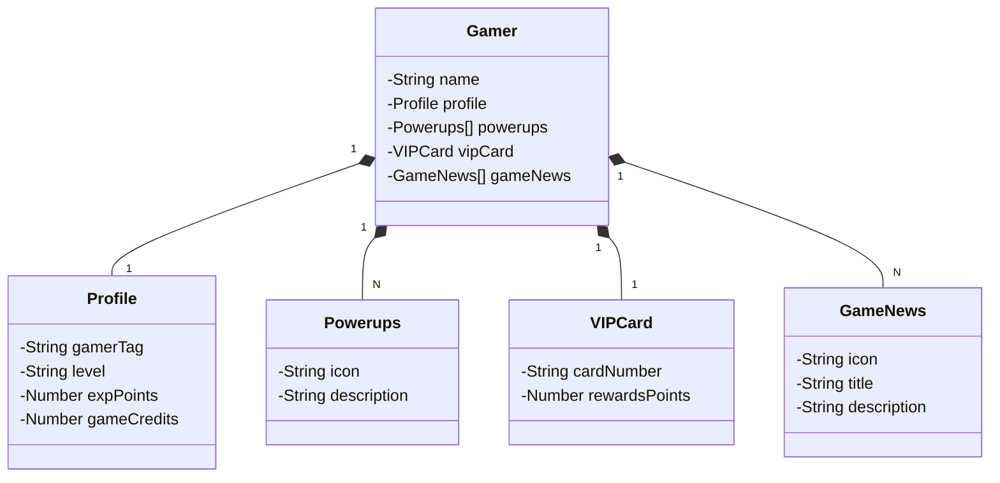

# santander Dev Week 2023
JAVA RESTful API criada para a Santander Dev Week

## Diagrama de Classes

```mermaid
classDiagram
  class Gamer {
    -String name
    -Profile profile
    -Powerups[] powerups
    -VIPCard vipCard
    -GameNews[] gameNews
  }
  
  class Profile {
    -String gamerTag
    -String level
    -Number expPoints
    -Number gameCredits
  }
  
  class Powerups {
    -String icon
    -String description
  }
  
  class VIPCard {
    -String cardNumber
    -Number rewardsPoints
  }
  
  class GameNews {
    -String icon
    -String title
    -String description
  }

  Gamer "1" *-- "1" Profile
  Gamer "1" *-- "N" Powerups
  Gamer "1" *-- "1" VIPCard
  Gamer "1" *-- "N" GameNews
```
